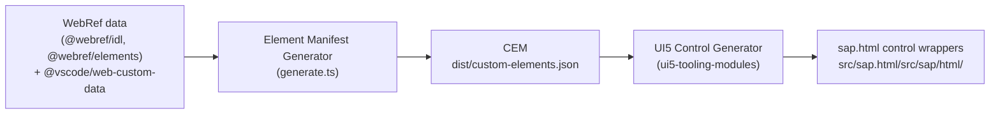

# lib/html — sap.html library generator

This subproject consists of two parts:
1. the Element Manifest Generator
2. the UI5 control generator

The first part is fully contained in this subproject, whereas the second part is contained in the [`ui5-tooling-modules`](https://www.npmjs.com/package/ui5-tooling-modules) package of the UI5 ecosystem.

## Overview

Both stages run in sequence via `npm run build`.

## Documentation

- [The Element Manifest Generator](docs/element-manifest-generator.md) — how the CEM (`dist/custom-elements.json`) is produced from the WebRef IDL and data.
- [The UI5 Control Generator](docs/ui5-control-generator.md) — how `ui5-tooling-modules` turns the CEM into the `sap.html` UI5 control wrappers.
